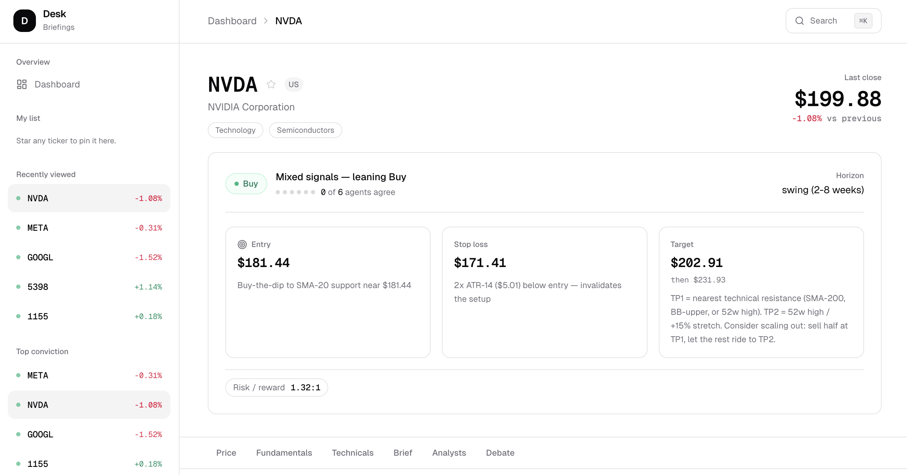

<p align="center">
  
</p>

<h1 align="center">AI Stock Analysis 📈</h1>

<p align="center">
  <a href="https://www.python.org/downloads/"></a>
  <a href="LICENSE"></a>
  <a href="https://github.com/KelvinYou/ai-stock-analysis/actions/workflows/fetch.yml"></a>
  <a href="https://github.com/anthropics/claude-agent-sdk"></a>
</p>

<p align="center">
  <b>Four specialist agents research a stock. A bull and a bear debate their findings. A synthesizer turns the argument into an actionable briefing — with entry, stop, and target levels.</b>
</p>

---

**A four-layer research pipeline for equity decision support.** Fundamentals, Sentiment, Technical, and Macro/FX agents run in parallel. A Bull and Bear researcher then debate their findings across multiple rounds. A synthesizer merges the argument into a briefing with concrete price levels gated on conviction — not abstract "hold" signals.

Built on the [Claude Agent SDK](https://github.com/anthropics/claude-agent-sdk) with mixed-model routing — Haiku for analyst agents, Opus for adversarial debate, Sonnet for synthesis — so cost scales with the reasoning depth each layer actually needs.

<table>
<tr><td width="30%"><b>🧑‍💼 Four parallel analyst agents</b></td><td>Fundamentals, Sentiment, Technical, and Macro/FX run concurrently. Each returns a typed report with a signal (strong buy → strong sell) and a confidence score.</td></tr>
<tr><td><b>⚖️ Adversarial bull/bear debate</b></td><td>Multi-round researcher debate surfaces points of agreement, disagreement, and unresolved uncertainty — not a single averaged take.</td></tr>
<tr><td><b>🎯 Actionable price levels</b></td><td>Briefings include entry, stop, and target levels gated on conviction. No abstract signals that tell you nothing.</td></tr>
<tr><td><b>📊 Conviction & convergence metrics</b></td><td>Every briefing reports a conviction score (−1.0 to +1.0) and a signal-convergence score showing how much the four agents actually agreed.</td></tr>
<tr><td><b>⏮️ Historical backtesting</b></td><td>Replay the full pipeline over any date range. Score hit rate and directional accuracy against realized price moves.</td></tr>
<tr><td><b>🖥️ Web dashboard + REST API</b></td><td>Next.js portfolio view with per-ticker drill-down. FastAPI job queue for programmatic runs. Conviction meter, debate transcript, watchlist.</td></tr>
<tr><td><b>💸 Cost-tuned model routing</b></td><td>Haiku for analyst agents, Opus for debate, Sonnet for synthesis. Configurable per layer in <code>config.py</code>.</td></tr>
</table>

---

## Quick Start

```bash
git clone https://github.com/KelvinYou/ai-stock-analysis.git
cd ai-stock-analysis
python -m venv .venv && source .venv/bin/activate
pip install -e .
export ANTHROPIC_API_KEY=sk-ant-...

stock-analysis AAPL --market US -v
```

Works on Linux, macOS, and WSL2 with Python 3.12+. Node.js 18+ is required for the web dashboard.

---

## Commands

| Command | Purpose |
|---------|---------|
| `stock-fetch <TICKER>...` | Fetch and persist market data (Layer 1 only). |
| `stock-fetch --universe sp500` | Fetch a whole universe (`sp500`, `nasdaq100`, `klci`). |
| `stock-analysis <TICKER>` | Run the full four-layer pipeline for one ticker. |
| `stock-analysis-backtest` | Replay the pipeline over a historical date range and score it. |
| `uvicorn stock_analysis.api.app:app --reload` | Start the FastAPI job server. |
| `cd web && npm run dev` | Start the Next.js dashboard on port 3000. |

See [Usage](#usage) for full flag reference.

---

## Architecture

```
Data Ingestion  -->  Analyst Agents  -->  Adversarial Debate  -->  Synthesis & Briefing
  (Layer 1)           (Layer 2)            (Layer 3)               (Layer 4)
```

**Layer 1 — Data Ingestion** fetches market data deterministically with no LLM involvement. Supports US equities via [yfinance](https://github.com/ranaroussi/yfinance) and Bursa/KLSE (Malaysia, stub). Ticker universes (S&P 500, NASDAQ 100, FBM KLCI) are pulled from Wikipedia.

**Layer 2 — Analyst Agents** run four specialist LLM agents in parallel:
- **Fundamentals** — P/E ratios, margins, debt structure, growth outlook
- **Sentiment** — News tone, social sentiment, key themes
- **Technical** — RSI, MACD, volume analysis, support/resistance levels
- **Macro/FX** — Fed policy, interest rates, FX impact, geopolitical risks

Each agent produces a structured report with a signal (strong buy → strong sell) and confidence level.

**Layer 3 — Adversarial Debate** pits a Bull researcher against a Bear researcher across multiple rounds. They build cases, rebut each other, and surface points of agreement, disagreement, and unresolved uncertainty.

**Layer 4 — Synthesis** merges all reports and debate output into a final briefing with a conviction score, risk assessment, entry/stop/target price levels, and executive summary.

See [`architecture.md`](architecture.md) for the full diagram.

---

## Markets Supported

| Market | Status | Data Sources |
|--------|--------|-------------|
| US (NYSE, NASDAQ) | Implemented | yfinance (price, financials, news, analyst recs) |
| Malaysia (Bursa/KLSE) | Stub | Planned: Bursa API, BNM rates, MYR/USD FX |

---

## Prerequisites

- Python 3.12+
- An [Anthropic API key](https://console.anthropic.com/) (`ANTHROPIC_API_KEY` env var)
- Node.js 18+ (for the web dashboard)

## Setup

```bash
# Clone the repository
git clone <repo-url>
cd ai-stock-analysis

# Create a virtual environment and install
python -m venv .venv
source .venv/bin/activate
pip install -e .

# For development (linting, testing)
pip install -e ".[dev]"

# Set your API key
export ANTHROPIC_API_KEY=sk-ant-...
```

---

## Usage

### Fetch market data

```bash
# Fetch data for one or more tickers
stock-fetch AAPL MSFT GOOGL

# Fetch all S&P 500 tickers
stock-fetch --universe sp500
```

### Run a full analysis

```bash
# Full pipeline: data → agents → debate → synthesis
stock-analysis AAPL --market US --rounds 3 --model haiku --debate-model opus -v
```

### Run backtests

```bash
stock-analysis-backtest --tickers AAPL,MSFT --start 2024-01-01 --end 2024-12-31
```

### Web dashboard

```bash
cd web
npm install
npm run dev
# → http://localhost:3000
```

---

## Project Structure

```
src/stock_analysis/
├── models/              # Pydantic data models
│   ├── market_data.py   # TickerData, PriceBar, FinancialStatements
│   ├── agent_reports.py # FundamentalsReport, SentimentReport, TechnicalReport, MacroFXReport
│   ├── debate.py        # DebateArgument, DebateRound, DebateResult
│   └── synthesis.py     # Briefing, ConvictionScore, RiskAssessment
├── data/                # Layer 1 — data fetching and storage
│   ├── fetcher_base.py  # Abstract BaseFetcher interface
│   ├── us_market.py     # USMarketFetcher (yfinance)
│   ├── my_market.py     # MYMarketFetcher (stub)
│   ├── technicals.py    # Technical indicator calculations
│   ├── universe.py      # Ticker universe loaders (S&P 500, NASDAQ 100, FBM KLCI)
│   └── store.py         # DataStore — JSON persistence per ticker/date
├── agents/              # Layer 2 — specialist analyst agents
│   ├── base.py          # BaseAnalystAgent
│   ├── fundamentals.py
│   ├── sentiment.py
│   ├── technical.py
│   └── macro.py
├── debate/              # Layer 3 — adversarial bull/bear debate
│   └── engine.py        # DebateEngine
├── synthesis/           # Layer 4 — synthesis and risk
│   ├── synthesizer.py   # SynthesizerAgent
│   └── risk_checker.py  # RiskChecker
├── backtest/            # Historical backtesting
│   ├── runner.py        # Backtester
│   ├── scorer.py        # Hit rate / accuracy scoring
│   ├── portfolio.py     # Portfolio-level simulation
│   └── fetcher.py       # Historical data helper
├── api/                 # FastAPI REST endpoints
│   └── app.py           # POST /analyze/{ticker}, GET /status/{job_id}, GET /results/{ticker}
├── config.py            # Settings (models, debate rounds, data dir)
├── orchestrator.py      # AnalysisPipeline — chains all four layers
├── fetch.py             # stock-fetch CLI entry point
└── main.py              # stock-analysis CLI entry point

web/                     # Next.js dashboard
├── app/
│   ├── page.tsx         # Ticker browser / home
│   ├── dashboard/       # Portfolio dashboard
│   └── [ticker]/        # Per-ticker analysis view
└── components/
    ├── briefing/        # Conviction meter, decision card, analyst/debate sections
    ├── chart/           # Price chart
    ├── ticker-list/     # Ticker browser, cards, star/watchlist
    └── shared/          # Reusable UI primitives
```

Data is stored as JSON files organized by ticker and date:

```
data/
└── AAPL/
    └── 2026-04-16/
        ├── market_data.json
        ├── analyst_reports.json
        ├── debate_result.json
        └── briefing.json
```

---

## Development

```bash
# Lint
ruff check src/

# Format
ruff format src/

# Run API server
uvicorn stock_analysis.api.app:app --reload

# Tests
pytest
pytest tests/path/to/test_file.py::test_name   # single test
```

---

## Tech Stack

- **LLM orchestration**: [Claude Agent SDK](https://github.com/anthropics/claude-agent-sdk) (Haiku / Sonnet / Opus)
- **Data models**: [Pydantic](https://docs.pydantic.dev/) v2
- **Market data**: [yfinance](https://github.com/ranaroussi/yfinance)
- **API**: [FastAPI](https://fastapi.tiangolo.com/) + [Uvicorn](https://www.uvicorn.org/)
- **Web dashboard**: [Next.js](https://nextjs.org/) + [Tailwind CSS](https://tailwindcss.com/)
- **HTTP client**: [httpx](https://www.python-httpx.org/)

---

## License

MIT — see [LICENSE](LICENSE).

## Disclaimer

This tool is for informational and educational purposes only. It is not financial advice. Always do your own research before making investment decisions.
