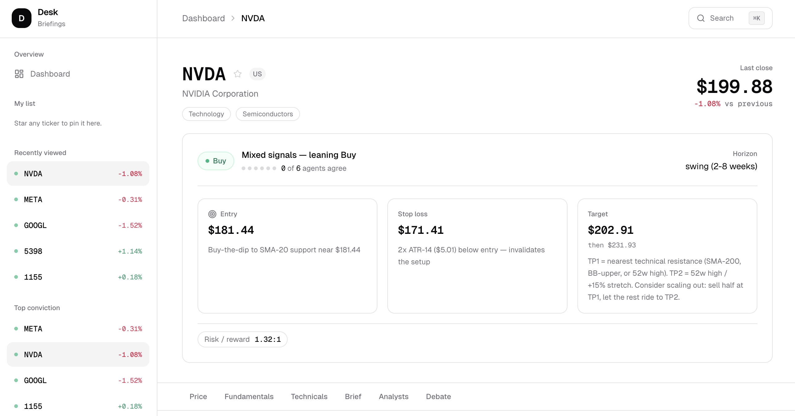

<p align="center">
  
</p>

<h1 align="center">AI Stock Analysis 📈</h1>

<p align="center">
  <a href="https://www.python.org/downloads/"></a>
  <a href="LICENSE"></a>
  <a href="https://github.com/KelvinYou/ai-stock-analysis/actions/workflows/fetch.yml"></a>
  <a href="https://github.com/anthropics/claude-agent-sdk"></a>
</p>

<p align="center">
  <b>Four specialist agents research a stock. A bull and a bear debate their findings. A synthesizer turns the argument into an actionable briefing — with entry, stop, and target levels.</b>
</p>

---

**A four-layer research pipeline for equity decision support.** Fundamentals, Sentiment, Technical, and Macro/FX agents run in parallel. A Bull and Bear researcher then debate their findings across multiple rounds. A synthesizer merges the argument into a briefing with concrete price levels gated on conviction — not abstract "hold" signals.

Built on the [Claude Agent SDK](https://github.com/anthropics/claude-agent-sdk) with mixed-model routing — Haiku for analyst agents, Opus for adversarial debate, Sonnet for synthesis — so cost scales with the reasoning depth each layer actually needs.

<table>
<tr><td width="30%"><b>🧑‍💼 Four parallel analyst agents</b></td><td>Fundamentals, Sentiment, Technical, and Macro/FX run concurrently. Each returns a typed report with a signal (strong buy → strong sell) and a confidence score.</td></tr>
<tr><td><b>⚖️ Adversarial bull/bear debate</b></td><td>Multi-round researcher debate surfaces points of agreement, disagreement, and unresolved uncertainty — not a single averaged take.</td></tr>
<tr><td><b>🎯 Actionable price levels</b></td><td>Briefings include entry, stop, and target levels gated on conviction. No abstract signals that tell you nothing.</td></tr>
<tr><td><b>📊 Conviction & convergence metrics</b></td><td>Every briefing reports a conviction score (−1.0 to +1.0) capped by the confidence-weighted net consensus of the four agents, plus a deterministic convergence score.</td></tr>
<tr><td><b>⏮️ Historical backtesting</b></td><td>Replay the full pipeline over any date range. Hit rate and directional accuracy against realized price moves — reported with confidence intervals, overlap-adjusted sample sizes, transaction costs, and a deflated Sharpe for the strategy comparison.</td></tr>
<tr><td><b>🖥️ Web dashboard + REST API</b></td><td>Next.js research dashboard with per-ticker drill-down. FastAPI job queue for programmatic runs. Conviction meter, debate transcript, watchlist.</td></tr>
<tr><td><b>💸 Cost-tuned model routing</b></td><td>Haiku for analyst agents, Opus for debate, Sonnet for synthesis. Configurable per layer in <code>config.py</code>.</td></tr>
</table>

---

## Quick Start

```bash
git clone https://github.com/KelvinYou/ai-stock-analysis.git
cd ai-stock-analysis
python -m venv .venv && source .venv/bin/activate
pip install -e .
export ANTHROPIC_API_KEY=sk-ant-...

stock-analysis AAPL --market US -v
```

Works on Linux, macOS, and WSL2 with Python 3.12+. Node.js 18+ is required for the web dashboard.

---

## Commands

| Command | Purpose |
|---------|---------|
| `stock-fetch <TICKER>...` | Fetch and persist market data (Layer 1 only). |
| `stock-fetch --universe sp500` | Fetch a whole universe (`sp500`, `nasdaq100`, `klci`). |
| `stock-analysis <TICKER>` | Run the full four-layer pipeline for one ticker. |
| `stock-analysis-backtest` | Replay the pipeline over a historical date range and score it. |
| `uvicorn stock_analysis.api.app:app --reload` | Start the FastAPI job server. |
| `cd web && npm run dev` | Start the Next.js dashboard on port 3000. |

See [Usage](#usage) for full flag reference.

---

## Architecture

```
Data Ingestion --> Analyst Agents --> Debate --> Research Manager --> Outcome Memory --> Synthesis
  (Layer 1)         (Layer 2)         (Layer 3)     (Layer 3.5)       (context)         (Layer 4)
                                                                                          |
                                                                                 Research Briefing
```

**Layer 1 — Data Ingestion** fetches market data deterministically with no LLM involvement. Supports US equities via [yfinance](https://github.com/ranaroussi/yfinance) and Bursa/KLSE (Malaysia) — the MY fetcher resolves names to codes via `BURSA_ALIASES` and appends the `.KL` suffix. Ticker universes (S&P 500, NASDAQ 100, FBM KLCI) are pulled from Wikipedia.

**Layer 2 — Analyst Agents** run four specialist LLM agents in parallel:
- **Fundamentals** — P/E ratios, margins, debt structure, growth outlook
- **Sentiment** — News tone, social sentiment, key themes
- **Technical** — RSI, MACD, volume analysis, support/resistance levels
- **Macro/FX** — Fed policy, interest rates, FX impact, geopolitical risks

Each agent produces a structured report with a signal (strong buy → strong sell) and confidence level.

**Layer 3 — Adversarial Debate** pits a Bull researcher against a Bear researcher across multiple rounds. They build cases, rebut each other, and surface points of agreement, disagreement, and unresolved uncertainty.

**Layer 3.5 — Research Manager** rules on the debate instead of summarizing it: which side carried the argument, the load-bearing thesis, the strongest counterexample to its own ruling, falsifiable invalidation conditions, and evidence gaps (data nobody had, as opposed to data both sides read differently).

**Layer 4 — Synthesis** merges reports, debate, verdict, and prior outcomes into a briefing with an executive summary, a conviction score, and deterministic entry/stop/target levels.

Two things are deliberately *not* left to the model here. `signal_convergence` is computed from the analyst reports rather than self-reported, because it gates whether concrete levels get quoted. And a neutral view is a valid result: this package emits research evidence and conditional price levels; it does not decide whether the idea fits a user's holdings.

**Outcome Memory** (deterministic supporting context) records what each resolved call actually earned, computes hit rate and conviction calibration, and feeds that track record into the next synthesis. Reads are gated on *exit* date, so a backtest can never see an outcome that had not resolved on the date being analyzed. Calibration is reported, never applied — nothing silently rescales a signal by a small-sample hit rate.

Portfolio valuation, concentration limits, position sizing, and buy/hold/sell decisions belong in the consuming application. This public repository has no dependency on `personal-os`, `portfolio.yaml`, `policy.yaml`, or private holdings.

See [`architecture.md`](architecture.md) for the full diagram.

---

## Markets Supported

| Market | Status | Data Sources |
|--------|--------|-------------|
| US (NYSE, NASDAQ) | Implemented | yfinance (price, financials, news, analyst recs) |
| Malaysia (Bursa/KLSE) | Implemented | yfinance via `.KL` suffix, `BURSA_ALIASES` name→code map |

---

## Prerequisites

- Python 3.12+
- An [Anthropic API key](https://console.anthropic.com/) (`ANTHROPIC_API_KEY` env var)
- Node.js 18+ (for the web dashboard)

## Setup

```bash
# Clone the repository
git clone <repo-url>
cd ai-stock-analysis

# Create a virtual environment and install
python -m venv .venv
source .venv/bin/activate
pip install -e .

# For development (linting, testing)
pip install -e ".[dev]"

# Set your API key
export ANTHROPIC_API_KEY=sk-ant-...
```

---

## Usage

### Fetch market data

```bash
# Fetch data for one or more tickers
stock-fetch AAPL MSFT GOOGL

# Fetch all S&P 500 tickers
stock-fetch --universe sp500
```

### Run a full analysis

```bash
# Full pipeline: data → agents → debate → synthesis
stock-analysis AAPL --market US --rounds 3 --model haiku --debate-model opus -v
```

### Portfolio decisions

This repository intentionally stops at stock research. If you need portfolio
valuation, concentration checks, or position sizing, consume the saved briefing
from your private application and apply those rules there.

### Run backtests

```bash
stock-analysis-backtest --tickers AAPL,MSFT --start 2024-01-01 --end 2024-12-31

# Charge a one-way transaction cost (bps) on entry and exit. Reports gross and
# net side by side — 0 is the default but it is an assumption, not neutral.
stock-analysis-backtest --tickers AAPL --start 2024-01-01 --end 2024-12-31 \
    --cost-bps 10

# Also feed realized outcomes back into outcome memory. Off by default so that
# repeated backtests over the same window stay comparable.
stock-analysis-backtest --tickers AAPL --start 2024-01-01 --end 2024-12-31 \
    --record-outcomes
```

Every headline metric ships with an interval, because a point estimate over a
few dozen trials reads as an edge whether or not it is one:

- **Hit rates** carry Wilson intervals, and the report says so outright when the
  interval still spans 50%.
- **Sample size is discounted for overlap.** Weekly as-of dates at a 30-day
  horizon share most of their price path; 13 nominal trials can be worth 1.8
  independent ones, and every t-statistic uses the discounted count.
- **Sharpe is reported probabilistically** (PSR), correcting for the negative
  skew and fat tails that flatter a raw Sharpe.
- **The strategy comparison is deflated.** Scoring six strategies and reporting
  the best is a search; the winner gets a Deflated Sharpe against the expected
  best-of-six under the null.

If `--interval` is shorter than `--horizon`, the report will tell you how much
of the sample is redundant.

### Run backtests in the current session (no API key)

The Python process cannot call the current Claude/Codex conversation directly.
Use the two-stage session mode instead: the first command writes point-in-time
input packets without future prices; the current session writes the compact
`SessionPrediction` records; the second command runs the normal scorer and
portfolio simulation.

```bash
stock-analysis-backtest --mode session-prepare \
  --tickers AAPL,MSFT --start 2025-08-01 --end 2026-07-01 \
  --session-dir /tmp/aapl-msft-session

# Write predictions.json in the session directory, then:
stock-analysis-backtest --mode session-score \
  --session-dir /tmp/aapl-msft-session \
  --output /tmp/aapl-msft-backtest
```

Session predictions must contain `ticker`, `as_of_date`, `overall_signal`,
`conviction_score`, `signal_convergence`, and optional `agent_signals` (whose
values are exact `strong_buy`, `buy`, `neutral`, `sell`, or `strong_sell`
signals). During scoring, convergence is recomputed from the analyst signals;
the conviction score is recalibrated to the net analyst consensus, and
directional predictions that disagree with that consensus or do not clear the
deterministic conviction/convergence execution gate are scored as `neutral`.
Optional `agent_confidences` can provide `high`, `medium`, or `low` weights.
Session packets also declare point-in-time evidence availability; when dated
news/recommendations or macro data are unavailable, scoring forces those
analysts to `neutral` with `low` confidence instead of trusting unsupported
directional output.

### Web dashboard

```bash
cd web
npm install
npm run dev
# → http://localhost:3000
```

Every ticker page carries a **Share** button that renders a 16:9 summary card —
verdict, price, levels, sparkline, and a QR code back to the page. The same
image is the page's Open Graph card, so pasting a link into Slack or WhatsApp
unfurls exactly what the button hands out.

The QR encodes an absolute URL, so any deployment that is not the local dev
server must set the origin:

```bash
NEXT_PUBLIC_SITE_URL=https://your-host.example npm run build
```

Left unset it falls back to `http://localhost:3000`, which is a dead scan on
anyone else's phone.

---

## Project Structure

```
src/stock_analysis/
├── models/              # Pydantic data models
│   ├── market_data.py   # TickerData, PriceBar, FinancialStatements
│   ├── agent_reports.py # FundamentalsReport, SentimentReport, TechnicalReport, MacroFXReport
│   ├── debate.py        # DebateArgument, DebateRound, DebateResult
│   └── synthesis.py     # Briefing, ConvictionScore, ActionPlan, RiskAssessment
├── data/                # Layer 1 — data fetching and storage
│   ├── fetcher_base.py  # Abstract BaseFetcher interface
│   ├── us_market.py     # USMarketFetcher (yfinance)
│   ├── my_market.py     # MYMarketFetcher (Bursa/KLSE, BURSA_ALIASES)
│   ├── technicals.py    # Technical indicator calculations
│   ├── universe.py      # Ticker universe loaders (S&P 500, NASDAQ 100, FBM KLCI)
│   └── store.py         # DataStore — flat per-ticker JSON persistence
├── agents/              # Layer 2 — specialist analyst agents
│   ├── base.py          # BaseAnalystAgent
│   ├── fundamentals.py
│   ├── sentiment.py
│   ├── technical.py
│   └── macro.py
├── debate/              # Layer 3 — adversarial bull/bear debate
│   └── engine.py        # DebateEngine
├── synthesis/           # Layer 4 — synthesis and risk
│   ├── synthesizer.py   # SynthesizerAgent
│   └── risk_checker.py  # RiskChecker
├── backtest/            # Historical backtesting
│   ├── runner.py        # Backtester
│   ├── scorer.py        # Hit rate / accuracy scoring, with interval estimates
│   ├── stats.py         # Wilson / Student-t / PSR / DSR, no scipy dependency
│   ├── portfolio.py     # Generic backtest simulation (no personal holdings)
│   └── fetcher.py       # Historical data helper
├── api/                 # FastAPI REST endpoints
│   └── app.py           # POST /analyze/{ticker}, GET /status/{job_id}, GET /results/{ticker}
├── config.py            # Settings (models, debate rounds, data dir)
├── orchestrator.py      # AnalysisPipeline — chains all four layers
├── fetch.py             # stock-fetch CLI entry point
└── main.py              # stock-analysis CLI entry point

pipeline.json            # Canonical pipeline shape — feeds /about + architecture.md
scripts/
└── sync_architecture.py # Regenerates the mermaid block from pipeline.json

web/                     # Next.js dashboard
├── app/
│   ├── page.tsx         # Screener — one sortable row per watchlist ticker
│   ├── about/           # Pipeline flowchart (SVG from pipeline.json) + glossary
│   ├── dashboard/       # Redirect to / (the screener moved there)
│   └── [ticker]/        # Per-ticker analysis view + opengraph/twitter-image
├── assets/fonts/        # Static subsetted TTFs — share card only (see its README)
├── lib/
│   ├── data.ts          # Reads data/<TICKER>/*.json into TickerSummary rows
│   ├── watchlist.ts     # Parses tickers.txt incl. #group / #theme markers
│   ├── screener.ts      # Column defs, sorting, at-entry / stale predicates
│   ├── pipeline.ts      # Loads pipeline.json + computes the flowchart layout
│   └── share/           # 16:9 share card: JSX, palette, QR + sparkline SVGs
└── components/
    ├── briefing/        # Conviction meter, decision card, analyst/debate sections
    ├── chart/           # Price chart
    ├── share/           # Share button — native sheet, clipboard, download
    ├── ticker-list/     # Screener table, cards, filters, star/watchlist
    └── shared/          # Data-status strip and other UI primitives
```

Data is stored **flat per ticker**, overwritten on each run:

```
data/
└── AAPL/
    ├── price_history.csv      # full OHLCV history, merged on each fetch
    ├── fundamentals.json      # TickerInfo + financials + news snapshot
    ├── technicals.json        # computed indicators (no LLM)
    ├── analyst_reports.json
    ├── debate_result.json
    ├── research_verdict.json  # Layer 3.5 adjudication
    ├── briefing.json
    ├── outcomes.jsonl         # append-only outcome log
    └── calibration.json       # computed track record
```

The dated `data/<TICKER>/<DATE>/` layout is a backtest-only fallback, used when a
`for_date` is passed. `DataStore`'s docstring is the authoritative reference.

---

## Development

`pipeline.json` at the repo root is the single source of truth for the pipeline's shape.
The `/about` page renders it as an SVG flowchart, and `scripts/sync_architecture.py`
renders it as the mermaid block in [`architecture.md`](architecture.md) — so edit
`pipeline.json`, never the diagram:

```bash
python scripts/sync_architecture.py           # rewrite architecture.md
python scripts/sync_architecture.py --check   # exit 1 if out of date (for CI)
```

```bash
# Lint
ruff check src/

# Format
ruff format src/

# Run API server
uvicorn stock_analysis.api.app:app --reload

# Tests
pytest
pytest tests/path/to/test_file.py::test_name   # single test
```

---

## Tech Stack

- **LLM orchestration**: [Claude Agent SDK](https://github.com/anthropics/claude-agent-sdk) (Haiku / Sonnet / Opus)
- **Data models**: [Pydantic](https://docs.pydantic.dev/) v2
- **Market data**: [yfinance](https://github.com/ranaroussi/yfinance)
- **API**: [FastAPI](https://fastapi.tiangolo.com/) + [Uvicorn](https://www.uvicorn.org/)
- **Web dashboard**: [Next.js](https://nextjs.org/) + [Tailwind CSS](https://tailwindcss.com/)
- **HTTP client**: [httpx](https://www.python-httpx.org/)

---

## License

MIT — see [LICENSE](LICENSE).

## Disclaimer

This tool is for informational and educational purposes only. It is not financial advice. Always do your own research before making investment decisions.
