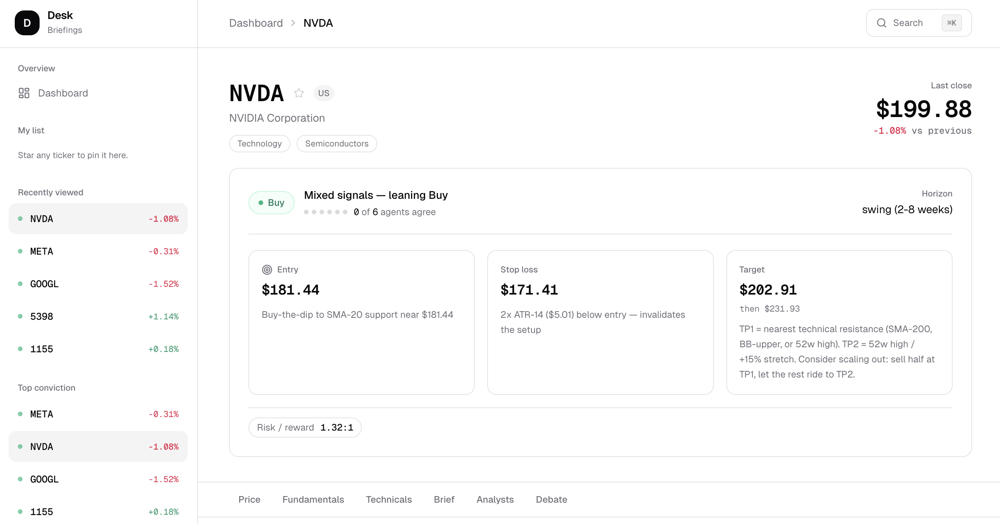

<p align="center">
  
</p>

<h1 align="center">AI Stock Analysis 📈</h1>

<p align="center">
  <a href="https://www.python.org/downloads/"></a>
  <a href="LICENSE"></a>
  <a href="https://github.com/KelvinYou/ai-stock-analysis/actions/workflows/fetch.yml"></a>
  <a href="https://github.com/anthropics/claude-agent-sdk"></a>
</p>

<p align="center">
  <b>Four specialist agents research a stock. A bull and a bear debate their findings. A synthesizer turns the argument into an actionable briefing — with entry, stop, and target levels.</b>
</p>

---

**A four-layer research pipeline for equity decision support.** Fundamentals, Sentiment, Technical, and Macro/FX agents run in parallel. A Bull and Bear researcher then debate their findings across multiple rounds. A synthesizer merges the argument into a briefing with concrete price levels gated on conviction — not abstract "hold" signals.

Built on the [Claude Agent SDK](https://github.com/anthropics/claude-agent-sdk) with mixed-model routing — Haiku for analyst agents, Opus for adversarial debate, Sonnet for synthesis — so cost scales with the reasoning depth each layer actually needs.

<table>
<tr><td width="30%"><b>🧑‍💼 Four parallel analyst agents</b></td><td>Fundamentals, Sentiment, Technical, and Macro/FX run concurrently. Each returns a typed report with a signal (strong buy → strong sell) and a confidence score.</td></tr>
<tr><td><b>⚖️ Adversarial bull/bear debate</b></td><td>Multi-round researcher debate surfaces points of agreement, disagreement, and unresolved uncertainty — not a single averaged take.</td></tr>
<tr><td><b>🎯 Actionable price levels</b></td><td>Briefings include entry, stop, and target levels gated on conviction. No abstract signals that tell you nothing.</td></tr>
<tr><td><b>📊 Conviction & convergence metrics</b></td><td>Every briefing reports a conviction score (−1.0 to +1.0) capped by the confidence-weighted net consensus of the four agents, plus a deterministic convergence score.</td></tr>
<tr><td><b>⏮️ Historical backtesting</b></td><td>Replay the full pipeline over any date range. Hit rate and directional accuracy against realized price moves — reported with confidence intervals, overlap-adjusted sample sizes, transaction costs, and a deflated Sharpe for the strategy comparison.</td></tr>
<tr><td><b>🖥️ Web dashboard + REST API</b></td><td>Next.js research dashboard with per-ticker drill-down. FastAPI job queue for programmatic runs. Conviction meter, debate transcript, watchlist.</td></tr>
<tr><td><b>💸 Cost-tuned model routing</b></td><td>Haiku for analyst agents, Opus for debate, Sonnet for synthesis. Configurable per layer in <code>config.py</code>.</td></tr>
</table>

---

## Quick Start

```bash
git clone https://github.com/KelvinYou/ai-stock-analysis.git
cd ai-stock-analysis
python -m venv .venv && source .venv/bin/activate
pip install -e .
export ANTHROPIC_API_KEY=sk-ant-...

stock-analysis AAPL --market US -v
```

Works on Linux, macOS, and WSL2 with Python 3.12+. Node.js 18+ is required for the web dashboard.

For a deployed backend, use `ANTHROPIC_API_KEY` as a server-side secret for the
worker; do not copy `~/.claude` or run an interactive login in a container. The
Agent SDK dependency is pinned and bundles the Claude Code CLI.

---

## Commands

| Command | Purpose |
|---------|---------|
| `stock-fetch <TICKER>...` | Fetch and persist market data (Layer 1 only). |
| `stock-fetch --universe sp500` | Fetch a whole universe (`sp500`, `nasdaq100`, `klci`). |
| `stock-analysis <TICKER>` | Run the full four-layer pipeline for one ticker. |
| `stock-analysis-backtest` | Replay the pipeline over a historical date range and score it. |
| `uvicorn stock_analysis.api.app:app --reload` | Start the FastAPI job server. |
| `stock-analysis-worker` | Process durable Supabase analysis jobs. |
| `cd web && npm run dev` | Start the Next.js dashboard on port 3000. |

See [Usage](#usage) for full flag reference.

---

## Architecture

```
Data Ingestion --> Analyst Agents --> Debate --> Research Manager --> Outcome Memory --> Synthesis
  (Layer 1)         (Layer 2)         (Layer 3)     (Layer 3.5)       (context)         (Layer 4)
                                                                                          |
                                                                                 Research Briefing
```

**Layer 1 — Data Ingestion** fetches market data deterministically with no LLM involvement. Supports US equities via [yfinance](https://github.com/ranaroussi/yfinance) and Bursa/KLSE (Malaysia) — the MY fetcher resolves names to codes via `BURSA_ALIASES` and appends the `.KL` suffix. Ticker universes (S&P 500, NASDAQ 100, FBM KLCI) are pulled from Wikipedia.

**Layer 2 — Analyst Agents** run four specialist LLM agents in parallel:
- **Fundamentals** — P/E ratios, margins, debt structure, growth outlook
- **Sentiment** — News tone, social sentiment, key themes
- **Technical** — RSI, MACD, volume analysis, support/resistance levels
- **Macro/FX** — Fed policy, interest rates, FX impact, geopolitical risks

Each agent produces a structured report with a signal (strong buy → strong sell) and confidence level.

**Layer 3 — Adversarial Debate** pits a Bull researcher against a Bear researcher across multiple rounds. They build cases, rebut each other, and surface points of agreement, disagreement, and unresolved uncertainty.

**Layer 3.5 — Research Manager** rules on the debate instead of summarizing it: which side carried the argument, the load-bearing thesis, the strongest counterexample to its own ruling, falsifiable invalidation conditions, and evidence gaps (data nobody had, as opposed to data both sides read differently).

**Layer 4 — Synthesis** merges reports, debate, verdict, and prior outcomes into a briefing with an executive summary, a conviction score, and deterministic entry/stop/target levels.

Two things are deliberately *not* left to the model here. `signal_convergence` is computed from the analyst reports rather than self-reported, because it gates whether concrete levels get quoted. And a neutral view is a valid result: this package emits research evidence and conditional price levels; it does not decide whether the idea fits a user's holdings.

**Outcome Memory** (deterministic supporting context) records what each resolved call actually earned, computes hit rate and conviction calibration, and feeds that track record into the next synthesis. Reads are gated on *exit* date, so a backtest can never see an outcome that had not resolved on the date being analyzed. Calibration is reported, never applied — nothing silently rescales a signal by a small-sample hit rate.

Portfolio valuation, concentration limits, position sizing, and buy/hold/sell decisions belong in the consuming application. This public repository has no dependency on `personal-os`, `portfolio.yaml`, `policy.yaml`, or private holdings.

See [`architecture.md`](architecture.md) for the full diagram.

---

## Markets Supported

| Market | Status | Data Sources |
|--------|--------|-------------|
| US (NYSE, NASDAQ) | Implemented | yfinance (price, financials, news, analyst recs) |
| Malaysia (Bursa/KLSE) | Implemented | yfinance via `.KL` suffix, `BURSA_ALIASES` name→code map |

---

## Prerequisites

- Python 3.12+
- An [Anthropic API key](https://console.anthropic.com/) (`ANTHROPIC_API_KEY` env var)
- Node.js 18+ (for the web dashboard)

Install with the dev extra — `pip install -e ".[dev]"` — if you intend to run
`ruff` or `pytest`. Everything else is covered by [Quick Start](#quick-start).

---

## Usage

### Fetch market data

```bash
# Fetch data for one or more tickers
stock-fetch AAPL MSFT GOOGL

# Fetch all S&P 500 tickers
stock-fetch --universe sp500
```

### Run a full analysis

```bash
# Full pipeline: data → agents → debate → synthesis
stock-analysis AAPL --market US --rounds 3 --model haiku --debate-model opus -v
```

### Portfolio decisions

This repository intentionally stops at stock research. If you need portfolio
valuation, concentration checks, or position sizing, consume the saved briefing
from your private application and apply those rules there.

### Run backtests

```bash
stock-analysis-backtest --tickers AAPL,MSFT --start 2024-01-01 --end 2024-12-31

# Charge a one-way transaction cost (bps) on entry and exit. Reports gross and
# net side by side — 0 is the default but it is an assumption, not neutral.
stock-analysis-backtest --tickers AAPL --start 2024-01-01 --end 2024-12-31 \
    --cost-bps 10

# Also feed realized outcomes back into outcome memory. Off by default so that
# repeated backtests over the same window stay comparable.
stock-analysis-backtest --tickers AAPL --start 2024-01-01 --end 2024-12-31 \
    --record-outcomes
```

API backtests regenerate every briefing. The old cache was keyed only by ticker
and date, so a changed model or prompt could inherit an older prediction while
the report named the new settings. `--no-resume` remains accepted for older
scripts but is now redundant. Portfolio comparisons stop if any requested trial
has a failed or missing outcome. Same-day orders size from one pre-session cash
balance, with equal scaling if their combined target exceeds that balance.

For an implementation-only rerun, keep the original scored trials, forward
price paths, and allocator ranking history fixed:

```bash
stock-analysis-backtest --mode rescore --score-report /tmp/original-score.json \
  --cost-bps 10 --output /tmp/corrected-score
```

When allocator scoring succeeds, new score artifacts include
`allocator_price_histories`, capped at the last decision date. `rescore` uses
that frozen panel and does not reread the mutable
price store. Older score artifacts without it still recalculate the primary
scorer and portfolio, but explicitly mark the sealed allocator and AI ablation
unavailable; they cannot reproduce those diagnostics. This is a development
comparison, not a fresh out-of-sample test. A second `session-score` call can
fetch revised historical prices and is therefore a different price snapshot.
Set `STORAGE_BACKEND=local` when the scored JSON must be written to `--output`;
the configured cloud backend stores the artifact remotely instead.

To attribute the return on idle portfolio cash, pass an official FRED DFF CSV
or a JSON/JSONL replay containing `FRED:DFF` observations:

```bash
stock-analysis-backtest --mode rescore --score-report /tmp/original-score.json \
  --cash-rate-replay /tmp/fred-dff.csv --cost-bps 10 \
  --output /tmp/cash-yield-score
```

The report compounds end-of-day uninvested cash at the latest DFF observation
available by that calendar date, using ACT/365 and at most four calendar days
of carry. It identifies DFF as a reference proxy rather than a brokerage sweep
or deposit yield. Cash attribution is diagnostic: it does not alter primary
strategy returns or the promotion gate. The source observations and hash are
embedded in the scored artifact so later fixed-input rescores need no network
refresh.

Portfolio comparisons also include `overall_fundamentals_confirmed`, a
research-only alternative that takes an overall directional signal only when
the fundamentals analyst agrees. It is included in the DSR strategy-search
denominator but does not replace the `overall` promotion candidate. This
post-hoc diagnostic is exploratory on previously inspected trials.

### Run deterministic factor research

This mode uses the local `data/<TICKER>/price_history.csv` only — no API key or
LLM call. It runs the fixed long-only momentum baseline through expanding
walk-forward folds, enters on the next bar's open, and reports gross and
cost-adjusted returns side by side:

```bash
stock-analysis-backtest --mode factor --tickers AAPL \
  --start 2020-01-01 --end 2026-08-14 \
  --factor-lookback-bars 20 --factor-holding-bars 20 \
  --walk-forward-train-bars 252 --walk-forward-test-bars 63 \
  --cost-bps 10 --output factor-aapl
```

The factor is a research baseline, not a live-trading recommendation. The
output includes the exact protocol, fold boundaries, trade log, Wilson interval,
max drawdown, net p-value, and a buy-and-hold comparison. It does not fit a
model inside the test folds, so its result is evidence about one fixed rule on
one dataset rather than a claim of durable alpha.

Completed factor and cross-sectional runs append their candidate and strict-hold
benchmark to `backtest_experiments.jsonl` (override with `--experiment-ledger`).
Local runs also write `<output>.quality.json`; every Markdown report ends with
deterministic quality findings and next checks. The analysis flags benchmark
losses, uncertain intervals, small samples, and unverified return inputs. It
never changes a rule or promotes a historical winner. Ledger counts begin when
recording starts and do not reconstruct earlier manual searches; repeated
evaluations are identified separately. If identical frozen inputs and settings
produce different recorded metrics, the next quality report flags the change
for accounting review.

### Run cross-sectional allocation research

The cross-sectional mode tests a separate portfolio layer: at each month-end it
ranks a fixed universe by the previous 12 months' return, holds the equal-weight
top three for the next month, and charges entry, rebalance, and exit costs. The
strict equal-weight buy-and-hold benchmark uses the same first and last month-end:

```bash
stock-analysis-backtest --mode cross-sectional \
  --tickers AAPL,AMZN,AVGO,GOOGL,META,MSFT,NVDA,TSLA,TSM,UNH,V \
  --start 2019-01-01 --end 2026-09-17 \
  --cross-sectional-lookback-months 12 \
  --cross-sectional-top-n 3 \
  --cost-bps 10 --output cross-sectional-11
```

This is deterministic portfolio construction, not evidence that the AI analyst
layer forecasts returns. Freeze the universe and parameters before using a final
holdout; a result selected after inspecting that holdout is a research failure.

Every headline metric ships with an interval, because a point estimate over a
few dozen trials reads as an edge whether or not it is one:

- **Hit rates** carry Wilson intervals, and the report says so outright when the
  interval still spans 50%.
- **Sample size is discounted for overlap.** Weekly as-of dates at a 30-day
  horizon share most of their price path; 13 nominal trials can be worth 1.8
  independent ones, and every t-statistic uses the discounted count.
- **Sharpe is reported probabilistically** (PSR), correcting for the negative
  skew and fat tails that flatter a raw Sharpe.
- **The strategy comparison is deflated.** Scoring several strategies and
  reporting the best is a search; the winner gets a Deflated Sharpe against the
  expected best-of-N under the null.

If `--interval` is shorter than `--horizon`, the report will tell you how much
of the sample is redundant.

### Run backtests in the current session (no API key)

The Python process cannot call the current Claude/Codex conversation directly.
Use the two-stage session mode instead: the first command writes point-in-time
input packets without future prices; the current session writes the compact
`SessionPrediction` records; the second command runs the normal scorer and
portfolio simulation.

```bash
stock-analysis-backtest --mode session-prepare \
  --tickers AAPL,MSFT --start 2025-08-01 --end 2026-07-01 \
  --session-dir /tmp/aapl-msft-session

# Write predictions.json in the session directory, then:
stock-analysis-backtest --mode session-score \
  --session-dir /tmp/aapl-msft-session \
  --output /tmp/aapl-msft-backtest
```

If sealed 30-day windows overlap, the allocator/AI ablation now uses the
earliest feasible non-overlapping date subset, chosen from execution dates
without consulting returns. The primary pipeline and long-hold score still use
every trial. Markdown, JSON, and the experiment ledger label the subset
`research_only`; its result cannot satisfy the primary promotion gate. The
subset is a diagnostic of AI's incremental value, not a replacement for a
prospectively frozen non-overlapping schedule.

Session predictions must contain `ticker`, `as_of_date`, `overall_signal`,
`conviction_score`, `signal_convergence`, and optional `agent_signals` (whose
values are exact `strong_buy`, `buy`, `neutral`, `sell`, or `strong_sell`
signals). The declared ticker/date grid must be complete, extra predictions are rejected,
and every packet's identity, path, and price dates are checked before forward
prices are fetched. Historical packet metadata uses the requested ticker as
the name and market-default currency; present-day provider names are not
point-in-time evidence. During scoring, convergence is recomputed from the
analyst signals;
the conviction score is recalibrated to the net analyst consensus, and
directional predictions that disagree with that consensus or do not clear the
deterministic conviction/convergence execution gate are scored as `neutral`.
The recalibrated conviction remains an attribution score even when the final
signal is `neutral`; it does not create a portfolio trade unless the execution
gate is cleared.
Optional `agent_confidences` can provide `high`, `medium`, or `low` weights.
Session packets also declare point-in-time evidence availability. Without a
replay directory, historical fundamentals use the yfinance filing-date adapter
and latest-only yfinance news is excluded. For a stricter replay, the builder
below supplies SEC CompanyFacts fundamentals, SEC filing events, and FRED DFF;
current company-name, sector, and industry metadata is omitted unless a
versioned source is provided. Legacy packets containing current names under
an omitted-metadata marker fail the external metadata gate. When fundamentals,
dated news/recommendations, or macro data are
unavailable, scoring forces those analysts to `neutral` with `low` confidence
instead of trusting unsupported directional output. When availability is
declared, unavailable analysts are excluded from the consensus denominator
rather than being counted as neutral evidence.

Scored trial JSON preserves the signal path for later attribution:
raw_agent_signals are the original analyst labels; agent_signals are the labels
used by strategies after evidence guards and name normalization;
synthesized_signal is the overall choice before deterministic gates;
overall_signal is the final executable signal; and
signal_gate_reasons contains stable reason codes. The Markdown report adds
descriptive buy-overlap and gate counts. Older artifacts remain readable, but
missing trace fields mean provenance was not recorded.

To add historical evidence without opening a look-ahead path, pass a replay
directory to `session-prepare`:

```text
replay/
├── fundamentals/AAPL.jsonl # SEC facts + fiscal_period_end + available_as_of
├── news/AAPL.jsonl         # published_at + available_as_of per record
└── macro.jsonl             # as_of_date + available_as_of per snapshot
```

```bash
stock-analysis-backtest --mode session-prepare \
  --tickers AAPL,MSFT --start 2025-08-01 --end 2026-07-01 \
  --session-dir /tmp/aapl-msft-session --replay-dir /path/to/replay
```

The loader keeps a record only when both clocks are on or before the trial
date. Missing or malformed replay timestamps are excluded or fail closed; the
pipeline never infers availability from a fiscal/event date alone. No replay
directory means sentiment and macro remain explicitly unavailable, preserving
the current behaviour.

The reproducible public-source builder is:

```bash
python -m stock_analysis.backtest.replay_builder \
  --tickers AAPL,MSFT \
  --start 2019-01-01 --end 2026-07-31 \
  --output /tmp/stock-replay \
  --user-agent 'your-project/1.0 contact: you@example.com'
```

SEC filing events are a dated primary event layer, not a complete historical
provider news feed. FRED DFF is a dated Fed-funds series, not a complete macro
dataset. These limitations are recorded in `manifest.json` and are enforced by
the external validation gate. A custom news replay must explicitly declare
`manifest.news.source.kind: provider_versioned` to satisfy that gate; an
ambiguous or SEC-only replay remains blocked.

Before treating a provider-backed score as externally validated, run:

```bash
stock-analysis-backtest --mode external-validate \
  --session-dir /tmp/stock-session \
  --score-report /tmp/stock-session/score.json
```

The gate checks packet pairing, complete scored coverage of the frozen panel,
a survivorship-safe universe artifact, externally calibrated costs, effective
sample size, and a strict long-hold win.
Provider metadata is currently self-declared: even a well-formed
`provider_run.json` remains `BLOCKED` until a real invocation is bound to the
exact predictions and scored result. Missing artifacts return `BLOCKED`;
observed mismatches return `FAIL`.

`universe.json` uses schema version 1. It must record the source URL and
extract hash, a frozen selection policy, the exact session tickers, and one
`membership_records` row per `(ticker, as_of_date)` trial with a stable
`security_id` and `member: true`. `membership_records_sha256` is the SHA-256 of
the compact, key-sorted JSON encoding of that array. Its `return_treatment`
object must identify a hashed total-return source, include distributions,
delisting returns, and merger consideration, and set
`missing_return_policy: "fail_closed"`. The scored JSON must carry the exact
same object at `result.settings.terminal_return_provenance`; otherwise the
terminal-return provenance gate fails. The current yfinance-backed scorer does
not yet emit this provenance, so a universe metadata file alone cannot make a
run pass.

The portfolio table reports each strategy's excess return versus the strict
equal-weight `buy_and_hold` benchmark: one position per ticker from its first
available entry to its last available exit. `rolling_long` is retained as a
diagnostic baseline for the older rolling-entry semantics. A strategy is not
promotion-ready merely because it ranks first on Sharpe: the benchmark gate
requires an observed benchmark win, portfolio effective sample size of at
least 30, and a deflated Sharpe of at least 95%. The effective-sample contract
is `portfolio_overlap_clustered_v1`: same-date securities share one dependence
cluster and overlapping holding windows are discounted. The external validator
requires this marker on the `overall` portfolio row; legacy scores without it
are blocked, even if their ticker-level `effective_n` is large.

`session-score` also appends a separate sealed-trial cross-sectional allocation
section and `cross_sectional_trial_allocation` JSON field. It ranks the fixed
universe by trailing price return using only data available at each as-of date,
then applies the selected tickers' sealed forward outcomes. This deterministic
layer is reported for comparison, but it does not alter the AI signal rows or
the promotion gate; a missing price history fails that section closed.

When synchronized AI predictions are available, the same output adds an
`AI Signal Ablation` section and `signal_ablation` JSON field. It reports an
AI-only long sleeve and an AI-positive filter over the fixed momentum basket,
both against exposure-matched references. A conditional permutation test
reassigns positive AI labels within each momentum basket while preserving the
period, basket, and positive-label count. These are attribution diagnostics;
they do not change the pipeline signal or promotion gate. Scored `api` and
`session-score` arms are recorded prospectively in an append-only
`backtest_experiments.jsonl` ledger in the current directory (override with
`--experiment-ledger`) with config/input fingerprints, headline and per-arm
metrics, and cumulative unique-config and scored-evaluation counts. Those
counts are audit metadata only; no cross-run DSR correction is applied.
Pre-ledger or manually explored candidates are not reconstructed.
The ablation's drawdown uses sealed-window endpoints only; it does not capture
losses inside a holding window.

### Web dashboard

```bash
cd web
npm install
npm run dev
# → http://localhost:3000
```

Every ticker page carries a **Share** button that renders a 16:9 summary card —
verdict, price, levels, sparkline, and a QR code back to the page. The same
image is the page's Open Graph card, so pasting a link into Slack or WhatsApp
unfurls exactly what the button hands out.

The QR encodes an absolute URL, so any deployment that is not the local dev
server must set the origin:

```bash
NEXT_PUBLIC_SITE_URL=https://your-host.example npm run build
```

Left unset it falls back to `http://localhost:3000`, which is a dead scan on
anyone else's phone.

For a deployed dashboard, configure the Next.js server to read through the
FastAPI public-data seam. These variables are server-only — never prefix the
token with `NEXT_PUBLIC_`:

```bash
STOCK_ANALYSIS_API_URL=https://api.your-host.example
STOCK_ANALYSIS_API_TOKEN=your-fastapi-bearer-token
NEXT_PUBLIC_SITE_URL=https://your-host.example
```

The dashboard then calls `GET /api/v1/tickers`,
`GET /api/v1/tickers/{ticker}`, and `GET /api/v1/watchlist`. It does not need a
Supabase key in the deployed web bundle. Direct Supabase reads remain only as a
local transition fallback when the FastAPI variables are unset.

The analysis API accepts `X-Idempotency-Key` for safe client retries. A key is
bound to the complete ticker/market/settings request; changing those values
with the same key returns `409`. Cloud requests are queued durably, and worker
replica count controls parallelism. `ANALYSIS_QUOTA_TIMEZONE` controls the
daily cost-quota boundary (default `Asia/Kuala_Lumpur`).

### Cloud-first storage

The default backend remains local for offline tests. To avoid durable local
analysis files, configure `STORAGE_BACKEND=supabase`:

```bash
export STORAGE_BACKEND=supabase
export SUPABASE_URL=https://your-project.supabase.co
export SUPABASE_SERVICE_ROLE_KEY=your-server-only-service-key

stock-analysis-worker
```

The worker claims rows from the durable `analysis_runs` queue and writes typed
market snapshots, immutable per-layer artifacts, outcomes, and backtest
reports to Supabase. In deployment, the Next.js server reads completed public
data through FastAPI; it does not need a local `data/` directory or a Supabase
key. See
[`docs/supabase.md`](docs/supabase.md) for migration, import, and deployment
steps.

### Deploy the backend

The API and worker run as two long-lived services from the same Docker image.
The API is public HTTPS plus a bearer token; the worker is private and consumes
the Supabase queue. See [`docs/deployment.md`](docs/deployment.md) for the
environment matrix, Docker commands, API calls, and acceptance checklist.

The repository also carries generated acceptance assets:

```bash
python scripts/generate_openapi.py       # write contracts/openapi.json
python scripts/generate_postman.py       # write the importable collection
python scripts/generate_openapi.py --check
python scripts/generate_postman.py --check
```

Import `postman/ai-stock-analysis.postman_collection.json` into Postman, set
`base_url` and `api_token`, and run the health/contract requests first. The
`Start paid canary` request enqueues a real LLM run and must be triggered
manually only after the non-cost checks pass.

---

## Project Structure

```
src/stock_analysis/
├── models/              # Pydantic data models
│   ├── market_data.py   # TickerData, PriceBar, FinancialStatements
│   ├── agent_reports.py # FundamentalsReport, SentimentReport, TechnicalReport, MacroFXReport
│   ├── debate.py        # DebateArgument, DebateRound, DebateResult
│   └── synthesis.py     # Briefing, ConvictionScore, ActionPlan, RiskAssessment
├── data/                # Layer 1 — data fetching and storage
│   ├── fetcher_base.py  # Abstract BaseFetcher interface
│   ├── us_market.py     # USMarketFetcher (yfinance)
│   ├── my_market.py     # MYMarketFetcher (Bursa/KLSE, BURSA_ALIASES)
│   ├── technicals.py    # Technical indicator calculations
│   ├── universe.py      # Ticker universe loaders (S&P 500, NASDAQ 100, FBM KLCI)
│   ├── store.py         # DataStore — local flat per-ticker persistence
│   └── cloud.py         # SupabaseAnalysisStore — cloud-first persistence
├── agents/              # Layer 2 — specialist analyst agents
│   ├── base.py          # BaseAnalystAgent
│   ├── fundamentals.py
│   ├── sentiment.py
│   ├── technical.py
│   └── macro.py
├── debate/              # Layer 3 — adversarial bull/bear debate
│   └── engine.py        # DebateEngine
├── synthesis/           # Layer 4 — synthesis and risk
│   ├── synthesizer.py   # SynthesizerAgent
│   └── risk_checker.py  # RiskChecker
├── backtest/            # Historical backtesting
│   ├── runner.py        # Backtester
│   ├── scorer.py        # Hit rate / accuracy scoring, with interval estimates
│   ├── stats.py         # Wilson / Student-t / PSR / DSR, no scipy dependency
│   ├── portfolio.py     # Generic backtest simulation (no personal holdings)
│   └── fetcher.py       # Historical data helper
├── api/                 # FastAPI REST endpoints
│   └── app.py           # versioned FastAPI control plane + health checks
├── worker.py            # Durable Supabase job worker
├── config.py            # Settings (models, debate rounds, data dir)
├── orchestrator.py      # AnalysisPipeline — chains all four layers
├── fetch.py             # stock-fetch CLI entry point
└── main.py              # stock-analysis CLI entry point

pipeline.json            # Canonical pipeline shape — feeds /about + architecture.md
scripts/
├── sync_architecture.py  # Regenerates the mermaid block from pipeline.json
├── generate_openapi.py   # Writes/checks the FastAPI contract snapshot
└── generate_postman.py   # Writes/checks the Postman acceptance collection

contracts/
└── openapi.json          # Generated FastAPI OpenAPI snapshot

postman/
└── ai-stock-analysis.postman_collection.json  # Generated API checks

web/                     # Next.js dashboard
├── app/
│   ├── page.tsx         # Screener — one sortable row per watchlist ticker
│   ├── about/           # Pipeline flowchart (SVG from pipeline.json) + glossary
│   ├── dashboard/       # Redirect to / (the screener moved there)
│   └── [ticker]/        # Per-ticker analysis view + opengraph/twitter-image
├── assets/fonts/        # Static subsetted TTFs — site + share cards
├── lib/
│   ├── api.ts            # Server-side FastAPI public-read client
│   ├── data.ts           # Reads FastAPI, Supabase, or local data into rows
│   ├── watchlist.ts      # Reads FastAPI, Supabase, or tickers.txt
│   ├── screener.ts      # Column defs, sorting, at-entry / stale predicates
│   ├── pipeline.ts      # Loads pipeline.json + computes the flowchart layout
│   └── share/           # 16:9 share card: JSX, palette, QR + sparkline SVGs
└── components/
    ├── briefing/        # Conviction meter, decision card, analyst/debate sections
    ├── chart/           # Price chart
    ├── share/           # Share button — native sheet, clipboard, download
    ├── ticker-list/     # Screener table, cards, filters, star/watchlist
    └── shared/          # Data-status strip and other UI primitives
```

Data is stored **flat per ticker**, overwritten on each run:

```
data/
└── AAPL/
    ├── price_history.csv      # full OHLCV history, merged on each fetch
    ├── fundamentals.json      # TickerInfo + financials + news snapshot
    ├── technicals.json        # computed indicators (no LLM)
    ├── analyst_reports.json
    ├── debate_result.json
    ├── research_verdict.json  # Layer 3.5 adjudication
    ├── briefing.json
    ├── outcomes.jsonl         # append-only outcome log
    └── calibration.json       # computed track record
```

The dated `data/<TICKER>/<DATE>/` layout is a backtest-only fallback, used when a
`for_date` is passed. `DataStore`'s docstring is the authoritative reference.

With `STORAGE_BACKEND=supabase`, these files are replaced by Postgres tables and
JSONB artifacts. A completed run is promoted to the latest ticker view only
after its final briefing artifact exists; failed runs never replace a previous
visible briefing.

---

## Development

`pipeline.json` at the repo root is the single source of truth for the pipeline's shape.
The `/about` page renders it as an SVG flowchart, and `scripts/sync_architecture.py`
renders it as the mermaid block in [`architecture.md`](architecture.md) — so edit
`pipeline.json`, never the diagram:

```bash
python scripts/sync_architecture.py           # rewrite architecture.md
python scripts/sync_architecture.py --check   # exit 1 if out of date (for CI)
```

```bash
# Lint
ruff check src/

# Format
ruff format src/

# Run API server
uvicorn stock_analysis.api.app:app --reload

# Contract snapshots / Postman collection
python scripts/generate_openapi.py
python scripts/generate_postman.py
python scripts/generate_openapi.py --check
python scripts/generate_postman.py --check

# Tests
pytest
pytest tests/path/to/test_file.py::test_name   # single test
```

---

## Tech Stack

- **LLM orchestration**: [Claude Agent SDK](https://github.com/anthropics/claude-agent-sdk) (Haiku / Sonnet / Opus)
- **Data models**: [Pydantic](https://docs.pydantic.dev/) v2
- **Market data**: [yfinance](https://github.com/ranaroussi/yfinance)
- **API**: [FastAPI](https://fastapi.tiangolo.com/) + [Uvicorn](https://www.uvicorn.org/)
- **Web dashboard**: [Next.js](https://nextjs.org/) + [Tailwind CSS](https://tailwindcss.com/)
- **HTTP client**: [httpx](https://www.python-httpx.org/)

---

## License

MIT — see [LICENSE](LICENSE).

## Disclaimer

This tool is for informational and educational purposes only. It is not financial advice. Always do your own research before making investment decisions.
