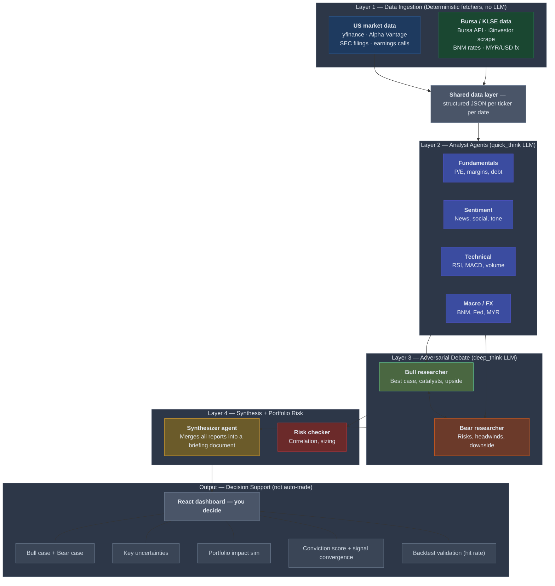

# AI Stock Analysis — Architecture

```mermaid
flowchart TD
    subgraph L1["Layer 1 — Data Ingestion (Deterministic fetchers, no LLM)"]
        US["<b>US market data</b><br/>yfinance · Alpha Vantage<br/>SEC filings · earnings calls"]
        MY["<b>Bursa / KLSE data</b><br/>Bursa API · i3investor scrape<br/>BNM rates · MYR/USD fx"]
    end

    US --> SDL
    MY --> SDL
    SDL["<b>Shared data layer</b> — structured JSON per ticker per date"]

    SDL --> L2

    subgraph L2["Layer 2 — Analyst Agents (quick_think LLM)"]
        direction LR
        FUN["<b>Fundamentals</b><br/>P/E, margins, debt"]
        SEN["<b>Sentiment</b><br/>News, social, tone"]
        TEC["<b>Technical</b><br/>RSI, MACD, volume"]
        MAC["<b>Macro / FX</b><br/>BNM, Fed, MYR"]
    end

    L2 --> BULL
    L2 --> BEAR

    subgraph L3["Layer 3 — Adversarial Debate (deep_think LLM)"]
        BULL["<b>Bull researcher</b><br/>Best case, catalysts, upside"]
        BEAR["<b>Bear researcher</b><br/>Risks, headwinds, downside"]
        BULL <--> BEAR
    end

    L3 --> SYN
    L3 --> RISK

    subgraph L4["Layer 4 — Synthesis + Portfolio Risk"]
        SYN["<b>Synthesizer agent</b><br/>Merges all reports into a briefing document"]
        RISK["<b>Risk checker</b><br/>Correlation, sizing"]
    end

    L4 --> DASH

    subgraph OUT["Output — Decision Support (not auto-trade)"]
        DASH["<b>React dashboard — you decide</b>"]
        DASH --- B1["Bull case + Bear case"]
        DASH --- B2["Key uncertainties"]
        DASH --- B3["Portfolio impact sim"]
        DASH --- B4["Conviction score + signal convergence"]
        DASH --- B5["Backtest validation (hit rate)"]
    end

    style L1 fill:#2d3748,stroke:#4a5568,color:#e2e8f0
    style US fill:#1e3a5f,stroke:#2c5282,color:#e2e8f0
    style MY fill:#1a4731,stroke:#276749,color:#e2e8f0
    style SDL fill:#4a5568,stroke:#718096,color:#e2e8f0

    style L2 fill:#2d3748,stroke:#4a5568,color:#e2e8f0
    style FUN fill:#3b4ca0,stroke:#4c51bf,color:#e2e8f0
    style SEN fill:#3b4ca0,stroke:#4c51bf,color:#e2e8f0
    style TEC fill:#3b4ca0,stroke:#4c51bf,color:#e2e8f0
    style MAC fill:#3b4ca0,stroke:#4c51bf,color:#e2e8f0

    style L3 fill:#2d3748,stroke:#4a5568,color:#e2e8f0
    style BULL fill:#4a6741,stroke:#68d391,color:#e2e8f0
    style BEAR fill:#6b3a2a,stroke:#c05621,color:#e2e8f0

    style L4 fill:#2d3748,stroke:#4a5568,color:#e2e8f0
    style SYN fill:#6b5b2a,stroke:#d69e2e,color:#e2e8f0
    style RISK fill:#6b2a2a,stroke:#c53030,color:#e2e8f0

    style OUT fill:#2d3748,stroke:#4a5568,color:#e2e8f0
    style DASH fill:#4a5568,stroke:#718096,color:#e2e8f0
    style B1 fill:#3a4556,stroke:#718096,color:#cbd5e0
    style B2 fill:#3a4556,stroke:#718096,color:#cbd5e0
    style B3 fill:#3a4556,stroke:#718096,color:#cbd5e0
    style B4 fill:#3a4556,stroke:#718096,color:#cbd5e0
    style B5 fill:#3a4556,stroke:#718096,color:#cbd5e0
```
