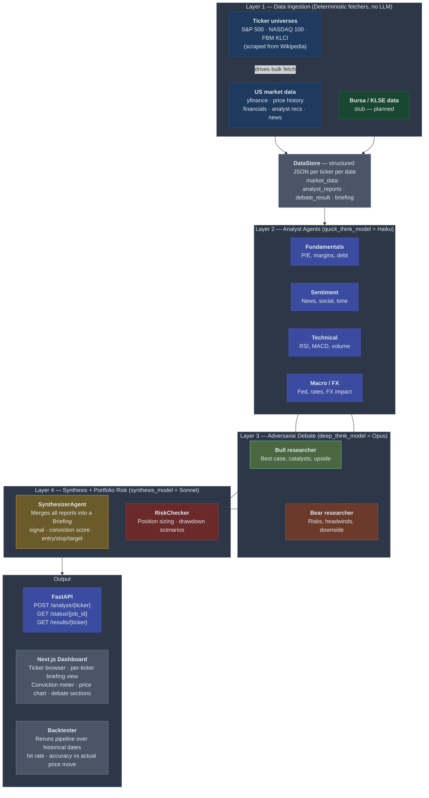

# AI Stock Analysis — Architecture

```mermaid
flowchart TD
    subgraph L1["Layer 1 — Data Ingestion (Deterministic fetchers, no LLM)"]
        US["<b>US market data</b><br/>yfinance · price history<br/>financials · analyst recs · news"]
        MY["<b>Bursa / KLSE data</b><br/>stub — planned"]
        UNI["<b>Ticker universes</b><br/>S&amp;P 500 · NASDAQ 100 · FBM KLCI<br/>(scraped from Wikipedia)"]
    end

    US --> SDL
    MY --> SDL
    UNI -.->|drives bulk fetch| US
    SDL["<b>DataStore</b> — structured JSON per ticker per date<br/>market_data · analyst_reports · debate_result · briefing"]

    SDL --> L2

    subgraph L2["Layer 2 — Analyst Agents (quick_think_model = Haiku)"]
        direction LR
        FUN["<b>Fundamentals</b><br/>P/E, margins, debt"]
        SEN["<b>Sentiment</b><br/>News, social, tone"]
        TEC["<b>Technical</b><br/>RSI, MACD, volume"]
        MAC["<b>Macro / FX</b><br/>Fed, rates, FX impact"]
    end

    L2 --> BULL
    L2 --> BEAR

    subgraph L3["Layer 3 — Adversarial Debate (deep_think_model = Opus)"]
        BULL["<b>Bull researcher</b><br/>Best case, catalysts, upside"]
        BEAR["<b>Bear researcher</b><br/>Risks, headwinds, downside"]
        BULL <--> BEAR
    end

    L3 --> SYN
    L3 --> RISK

    subgraph L4["Layer 4 — Synthesis + Portfolio Risk (synthesis_model = Sonnet)"]
        SYN["<b>SynthesizerAgent</b><br/>Merges all reports into a Briefing<br/>signal · conviction score · entry/stop/target"]
        RISK["<b>RiskChecker</b><br/>Position sizing · drawdown scenarios"]
    end

    L4 --> OUT

    subgraph OUT["Output"]
        API["<b>FastAPI</b><br/>POST /analyze/{ticker}<br/>GET /status/{job_id}<br/>GET /results/{ticker}"]
        DASH["<b>Next.js Dashboard</b><br/>Ticker browser · per-ticker briefing view<br/>Conviction meter · price chart · debate sections"]
        BT["<b>Backtester</b><br/>Reruns pipeline over historical dates<br/>hit rate · accuracy vs actual price move"]
    end

    style L1 fill:#2d3748,stroke:#4a5568,color:#e2e8f0
    style US fill:#1e3a5f,stroke:#2c5282,color:#e2e8f0
    style MY fill:#1a4731,stroke:#276749,color:#e2e8f0
    style UNI fill:#1e3a5f,stroke:#2c5282,color:#e2e8f0
    style SDL fill:#4a5568,stroke:#718096,color:#e2e8f0

    style L2 fill:#2d3748,stroke:#4a5568,color:#e2e8f0
    style FUN fill:#3b4ca0,stroke:#4c51bf,color:#e2e8f0
    style SEN fill:#3b4ca0,stroke:#4c51bf,color:#e2e8f0
    style TEC fill:#3b4ca0,stroke:#4c51bf,color:#e2e8f0
    style MAC fill:#3b4ca0,stroke:#4c51bf,color:#e2e8f0

    style L3 fill:#2d3748,stroke:#4a5568,color:#e2e8f0
    style BULL fill:#4a6741,stroke:#68d391,color:#e2e8f0
    style BEAR fill:#6b3a2a,stroke:#c05621,color:#e2e8f0

    style L4 fill:#2d3748,stroke:#4a5568,color:#e2e8f0
    style SYN fill:#6b5b2a,stroke:#d69e2e,color:#e2e8f0
    style RISK fill:#6b2a2a,stroke:#c53030,color:#e2e8f0

    style OUT fill:#2d3748,stroke:#4a5568,color:#e2e8f0
    style API fill:#3b4ca0,stroke:#4c51bf,color:#e2e8f0
    style DASH fill:#4a5568,stroke:#718096,color:#e2e8f0
    style BT fill:#4a5568,stroke:#718096,color:#e2e8f0
```
