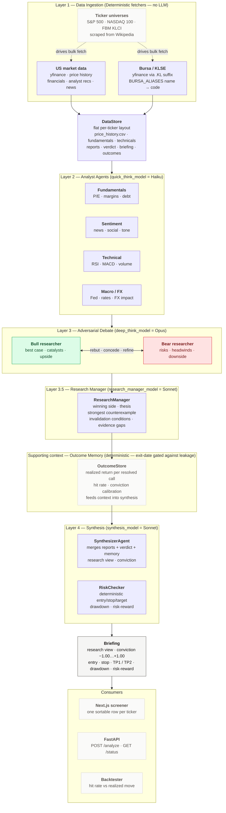

# AI Stock Analysis — Architecture

```mermaid
flowchart TD

    subgraph L1["Layer 1 — Data Ingestion (Deterministic fetchers — no LLM)"]
        UNI["<b>Ticker universes</b><br/>S&amp;P 500 · NASDAQ 100 · FBM KLCI<br/>scraped from Wikipedia"]
        US["<b>US market data</b><br/>yfinance · price history<br/>financials · analyst recs · news"]
        MY["<b>Bursa / KLSE</b><br/>yfinance via .KL suffix<br/>BURSA_ALIASES name → code"]
    end

    UNI -.->|"drives bulk fetch"| US
    UNI -.->|"drives bulk fetch"| MY
    SDL["<b>DataStore</b><br/>flat per-ticker layout<br/>price_history.csv · fundamentals · technicals<br/>reports · verdict · briefing · outcomes"]
    US --> SDL
    MY --> SDL

    subgraph L2["Layer 2 — Analyst Agents (quick_think_model = Haiku)"]
        direction LR
        FUN["<b>Fundamentals</b><br/>P/E · margins · debt"]
        SEN["<b>Sentiment</b><br/>news · social · tone"]
        TEC["<b>Technical</b><br/>RSI · MACD · volume"]
        MAC["<b>Macro / FX</b><br/>Fed · rates · FX impact"]
    end

    SDL --> L2

    subgraph L3["Layer 3 — Adversarial Debate (deep_think_model = Opus)"]
        direction LR
        BULL["<b>Bull researcher</b><br/>best case · catalysts · upside"]
        BEAR["<b>Bear researcher</b><br/>risks · headwinds · downside"]
        BULL <-->|"rebut · concede · refine"| BEAR
    end

    L2 --> L3

    subgraph L35["Layer 3.5 — Research Manager (research_manager_model = Sonnet)"]
        RM["<b>ResearchManager</b><br/>winning side · thesis<br/>strongest counterexample<br/>invalidation conditions · evidence gaps"]
    end

    L3 --> RM

    subgraph CTX["Supporting context — Outcome Memory (deterministic — exit-date gated against leakage)"]
        MEM["<b>OutcomeStore</b><br/>realized return per resolved call<br/>hit rate · conviction calibration<br/>feeds context into synthesis"]
    end

    RM --> MEM

    subgraph L4["Layer 4 — Synthesis (synthesis_model = Sonnet)"]
        direction LR
        SYN["<b>SynthesizerAgent</b><br/>merges reports + verdict + memory<br/>research view · conviction"]
        RISK["<b>RiskChecker</b><br/>deterministic entry/stop/target<br/>drawdown · risk-reward"]
    end

    MEM --> L4

    OUT["<b>Briefing</b><br/>research view · conviction −1.00…+1.00<br/>entry · stop · TP1 / TP2 · drawdown · risk-reward"]
    L4 --> OUT

    subgraph CONSUMERS["Consumers"]
        direction LR
        DASH["<b>Next.js screener</b><br/>one sortable row per ticker"]
        API["<b>FastAPI</b><br/>POST /analyze · GET /status"]
        BT["<b>Backtester</b><br/>hit rate vs realized move"]
    end
    OUT --> CONSUMERS

    style UNI fill:#fafaf9,stroke:#d6d3d1,color:#57534e
    style BULL fill:#dcfce7,stroke:#16a34a,color:#14532d
    style BEAR fill:#fee2e2,stroke:#dc2626,color:#7f1d1d
    style MEM fill:#fafaf9,stroke:#d6d3d1,color:#57534e
    style OUT fill:#f5f5f4,stroke:#57534e,color:#1c1917
    style DASH fill:#fafaf9,stroke:#d6d3d1,color:#57534e
    style API fill:#fafaf9,stroke:#d6d3d1,color:#57534e
    style BT fill:#fafaf9,stroke:#d6d3d1,color:#57534e
```
