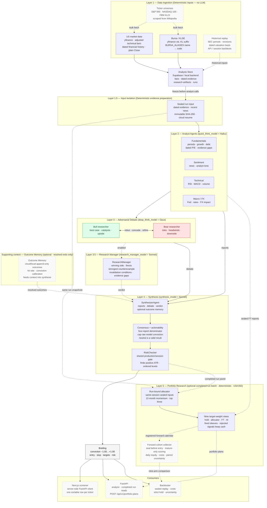

# AI Stock Analysis — Architecture

Single-ticker analysis produces a guarded briefing. An optional completed-run
batch feeds deterministic portfolio research through `/api/v1/portfolio-plans`:
12-month/top-three allocation, nine signal/passive views and explicit cash.
The forward collector seals inputs before entry, refuses immature outcomes and
compares daily equity after costs. These outputs remain research-only; collection
requires a pinned prospective calendar and model/prompt provenance. See
[the upgrade contract](docs/design/portfolio-pipeline-upgrade.md).

